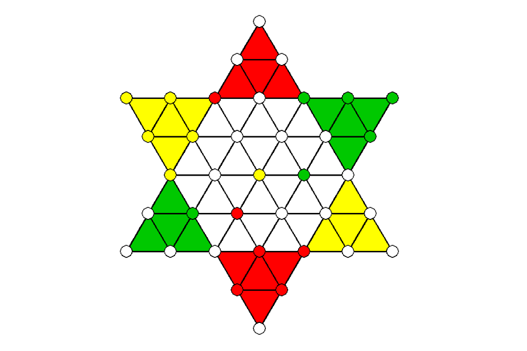
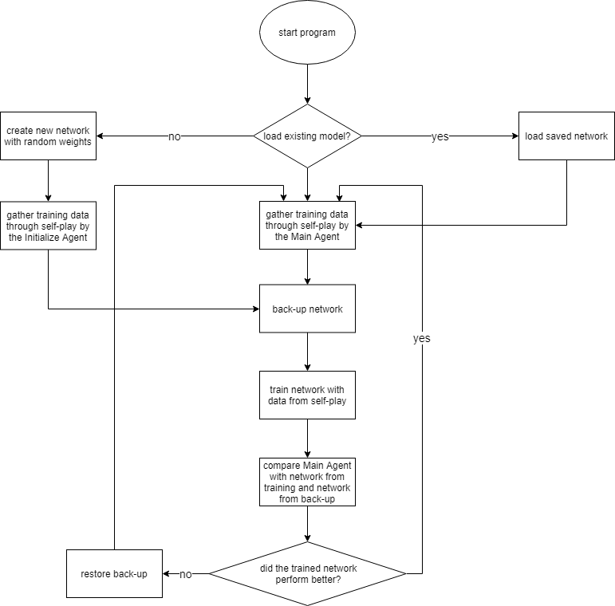
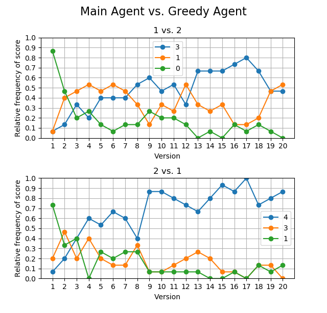
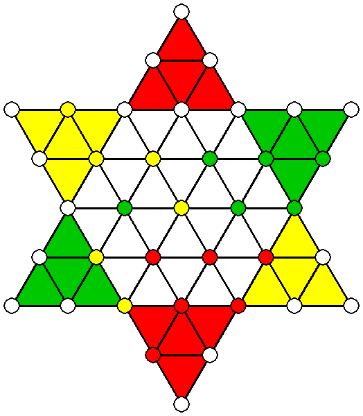
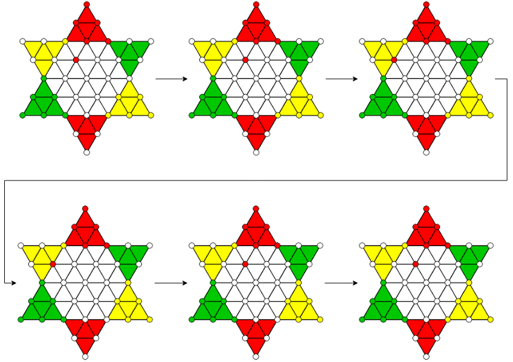

<a href="../index.html" class="logo">Project</a>

- [Portfolio](../index.html)
- [About me](../aboutme.html)

<!-- -->

- <a href="https://github.com/davidschulte"
  class="icon brands fa-github">GitHub</a>
- <a href="https://linkedin.com/in/davidsiriusschulte"
  class="icon brands fa-linkedin">Linkedin</a>

September 2019

# Reinforcement Learning for 3-player Chinese Checkers

AlphaZero is impressive. But what happens when we apply its logic to a
multiplayer game?

- <a href="https://github.com/davidschulte/alpha-thesis"
  class="icon brands alt fa-github">GitHub   
  Code</a>
- <a
  href="Reinforcement%20Learning%20for%203-Player%20Chinese%20Checkers.pdf"
  class="icon alt fa-file-pdf">Document 
  Thesis</a>

## Introduction

### Motivation

Like for many aspiring Machine Learning enthusiasts, the development of
AlphaZero could be described as the one event that made me sure, this is
the right field for me. I was curious how a program can learn such
sophisticated tactics in several domains just by playing against itself.
I researched the design of its algorithm and was fascinated by it, I
decided to dedicate my Bachelor's thesis to experimenting with it.  
The program is designed for learning a strategy for two-player zero-sum
games. But what would happen, if we break this assumption?

### The game

As application, I chose a game I know since my childhood: the
multiplayer board game Sternhalma (engl. Chinese Checkers). The goal of
each player is to maneuver their figures from their designated starting
zone across the board into their end zone before the others manage to do
so. Players take turns and can try to advance their pieces but also
block those of their opponents. The tactical core of the game is its
jumping role which enables long sequences of movements across the board.

## How it works

### Monte-Carlo tree search and Neural Net

AlphaZero is the successor of AlphaGo and AlphaGo Zero, all developed by
the research company Deep Mind. The program trains an agent that can
surpass previous human as well as algorithmic agents without any prior
knowledge about its domains, except for their rules. The domain that was
used for its showcase is the board game Go.

The core of AlphaZero is the combination of a Convolutional Neural
Network and a game tree which is traversed using a Monte-Carlo tree
search. The game tree of complex games like Go grows so quickly that
even algorithmically it becomes unfeasible to simulate all possible
positions after even a few turns from the current game state. But why
check every possible combination of plays when it is obvious that some
of them are just bad? If we only knew which branches of the tree are
even worth looking into. That is where Deep Learning comes into play.
Given a game state, a neural network predicts how likely each player is
to win, and which branches of the tree are worth looking into. This is
incorporated in a Monte-Carlo tree search, which enables the program to
navigate deeper into the game tree and find long-term strategies.

If you are interested in finding out more about the concept, visit the
[official page by
Deepmind](https://www.deepmind.com/blog/alphazero-shedding-new-light-on-chess-shogi-and-go).  
Another excellent resource is [this explanation by Surag
Nair](https://web.stanford.edu/~surag/posts/alphazero.html). The
corresponding Github repository of a simplified version of AlphaZero was
used as a basis for my project.

### Self-Play

The agent's training is carried out through self-play. We let the
current version play against identical duplicates of itself. This
results in played games, in which some moves lead to a better position
while some moves lead to a loss. We let the agents play a fixed number
of games and zip each played move together with the score it resulted in
in the end and feed this as training data into the neural network. Thus,
the network learns to favor moves that lead to a victory. After training
a new version of the agent, we let it play against the current version
and if it outperforms the status quo, it will be the new standard.

## Results

### Metrics

One of the metrics used to evaluate the agent is letting it play against
a greedy agent. A greedy agent makes one of the moves that advance his
pieces forward the most but does not plan ahead. Since we are evaluating
in a 3-player game, we display both scenarios: 2 Alphas vs. 1 Greedy
Agent and 1 Alpha vs. 2 Greedy Agents.

### Tactics

The two main components of the game are blocking your opponents and
using pieces on the board as a hopping ladder to race one own's pieces
into the end zone quicker. Since the board is relatively small, the
agents try to block their opponents during the middle game and then try
to race their pieces into the end zone at the last minute. Agents also
consider forced moves of their opponents and plan accordingly.  
It is also important to keep in mind that even though the board has
rotational symmetry, each player has a slightly different strategy, as
the order of moves is important.

## Difficulties

### Game Loops

A game loop is a sequence of moves by players that ends in the same game
state it started in. Board games that are played competitively usually
have rules that prevent these loops. For example, even in the game of
chess where one could imagine such a sequence, the [Fifty-move
rule](https://en.wikipedia.org/wiki/Fifty-move_rule) prevents game loops
and endless play.

Sternhalma traditionally does not have rules to prevent game loops. This
is especially problematic because a loop in the game destroys the
one-directional structure of its game tree, through which we have to
navigate. To fix this problem, I added such a rule to the game. However,
the agents sometimes also found a workaround around that and exploited
quasi-loops. Sequences that are not identical but lead to the same
result. I added a second rule that terminates the game after a specified
number of turns. In the graphic below, you can observe how the yellow
agent tries to exploit a quasi-loop. Green has already won first place
and Red only needs to bring one more figure into its end zone. Since
Green realizes that it will lose the game, it decides to block Red in
its end zone and drag the game on hopelessly instead of giving up and
losing the game.

### Exploration vs. Exploitation

Another difficulty is the right parameter that balances Exploration and
Exploitation. This is an important tradeoff when learning a new task. In
our case exploration means trying out new tactics that do not seem
promising at first glance in the hope of finding a hidden ingenious
move. Exploitation corresponds to a focus on moves that look promising
and predicting which of them will have been the best many moves later in
the game. In our game tree, those concepts are analogous to
breadth-first and depth-first search. Our Monte-Carlo tree search
contains a parameter that controls the balancing of both concepts.
Finding the optimal value for this parameter is not trivial and greatly
depends on the nature of the game. In this project, I experimented with
different values, but it is difficult to determine its optimum

## Learnings and Outlook

At the time I was a total beginner in Python and the field of AI.
Therefore, this turned out to be a very challenging project.
Nonetheless, it was a success resulting in a strong agent after 20
episodes of training. The bachelor's thesis was well received and was
graded with a 1.0 (A+). It contains more details and explanations about
the project. You can read it [here](documents/Thesis.pdf).  
Looking back now at it, I see a lot of things I would do differently
now. This mainly concerns the implementation and structure of the code.
On the other hand, one can see this as a measure of how much I learnt
since.  
The project also contains an implementation, in which the user can play
against one or several trained agents. In the future, I would like to
find a way to host this game online, as it can be a lot more impressive
to lose against the program than seeing its performance on charts.

### Email

<davidsiriusschulte@gmail.com>

### Social

- <a href="https://github.com/davidschulte"
  class="icon brands alt fa-github">GitHub/davidschulte</a>
- <a href="https://linkedin.com/in/davidsiriusschulte"
  class="icon brands fa-linkedin">GitHub/davidsiriusschulte</a>

- Design: [HTML5 UP](https://html5up.net)
