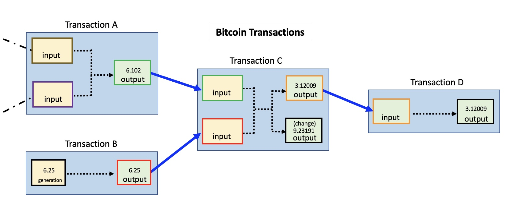
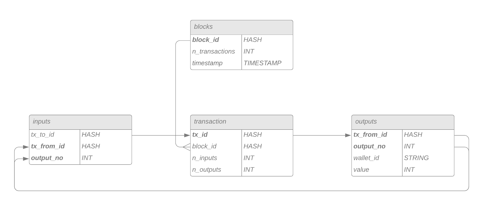
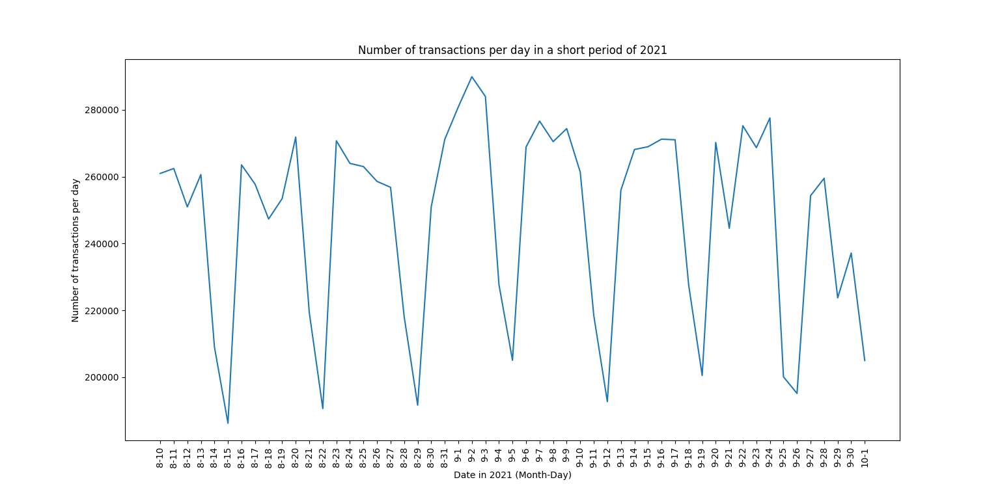
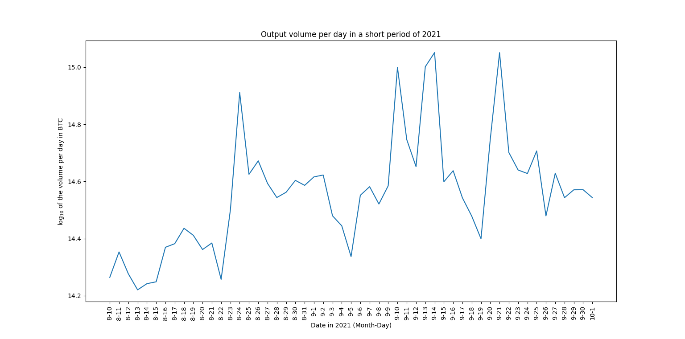
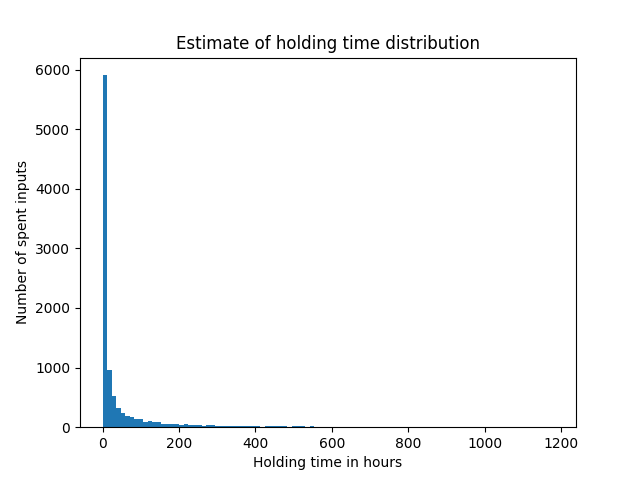

## Motivation

In recent years, cryptocurrencies made their way into the mainstream.
Their decentralized ungoverned nature made them attractive to people
that were unsatisfied with the current financial system. Their extreme
growth of value made them attractive to investors. Their volatility made
them attractive to speculators. Their anonymity made them attractive to
criminals.  
How anonymous and decentralized the most prominent cryptocurrency
bitcoin really is, was being researched resulting in surprising results.
You can read more about it in the Section **Further Research** down
below.

In this project, I focused on the most prominent cryptocurrency Bitcoin.
From the beginning, each transaction between users is recorded and saved
in the blockchain in such a way that it is publicly visible. If
interested in a transaction or specific wallet, users can navigate
through blockchain explorer websites like [SoChain](https://chain.so/)
.  
I inspected part of the Bitcoin transaction graph because I was
interested in the following questions:

- How do bitcoin users act in the network? Do they hold their coins as
  an investment or do they frequently transact with other users?
- Can we predict changes in the currency's value and volatility using
  the analysis of previous transactions?
- Can we spot cycles in the network that could lead to either stable
  business transactions or illegal activities like wash-trading and
  money laundering?

## Approach

As already mentioned, there are freely available block site explorers on
the internet. Interested in a specific transaction or wallet, they are
convenient and easy to navigate. Since we are not interested in
individuals but in computing metrics on large portions of the
transaction graph, we have to build our own solution.

### A transaction in the blockchain

[Source](https://en.bitcoin.it/wiki/Transaction)

Transactions are recorded in the blockchain. To be memory efficient
there is no redundant information in the data. There are several
important aspects of how transactions are encoded:

1.  Transactions are not just between two users. A transaction can
    contain multiple inputs and multiple outputs.
2.  The only way to split packages of coins is through transactions. You
    can only send the exact amount of coins you received in a previous
    transaction. If it is however more than you want to send, you will
    receive change.
3.  Based on the previous point, the outputs of a transaction directly
    correspond to inputs of previous transactions. Since their amount is
    the same, only output values are recorded and the value of inputs
    can be inferred through references to previous transactions.
4.  Every transaction has a small fee. This fee goes directly to the
    miner that verified the block the transaction is part of.

While these are the most important points, completely understanding the
system in which transactions are recorded can take some time. Luckily,
there is [this great
site](https://learnmeabitcoin.com/technical/transaction-data) that goes
more into detail about those encodings.

### A transaction database

To evaluate the transactions in the blockchain, we have to read them and
have a way to quickly navigate and aggregate them. My approach was to
build a relational database for transactions and wallets using MySQL.

### Data

Since the size of the blockchain is exponentially rising with time, with
the resources given in this project it was not feasible to read in the
complete blockchain. Instead, the analysis was conducted on a subset of
the data.

- Transactions in the timeframe: 9th August 2021 - 2nd October 2021
- 8000 blocks
- 13 million transactions
- 40 million inputs, 40 million outputs
- 84% of the inputs originate from outputs in the same period

## Results

**Disclaimer: Under the current circumstances some of the results are
biased. The transaction values are the sum of their outputs and
therefore do not consider which proportion of them is the change that
goes back to the sender. See the next section for a discussion on this
problem!**

### Daily transactions

First, we will investigate transactions per day.

We can clearly see a periodic pattern in the number of daily
transactions. Can you guess what the low points in the graph have in
common? They occur on Sundays. One way to interpret this is that the
difference between peaks and low points originates from the difference
between private traders and professional actors in the network that take
a time off on Sundays. While there can also be other explanations for
this large gap, this is an interesting clue for how the currency is used
in practice.

We can also observe strong daily variability in the sum of transaction
outputs.

### Average holding time

Another interesting question is: How long do people hold Bitcoin? Do
they use it for long-term investments? Do they use it as a currency for
business transactions? Do they perform high-frequency trading?

We can observe that the vast majority of Bitcoins get transferred again
just hours after their receiving. This hints at either high-frequency
trading or illegal activities like money laundering or wash trading.

### Daily distribution of transaction volumes

In the plot below, we can observe the distributions of transaction
volumes in BTC animated such that each frame represents one day in
September 2021.

These distributions can tell us, in what volumes Bitcoins are traded on
average. We can observe differences in distributions but also spikes at
the same places. This hints at similar trading activities by either the
same or different agents. We can also see constant output values around
104=1000 BTC. Keep in mind that with the average BTC price in
this timeframe of about 45,000$, this means that those transactions
transferred more than 45,000,000 dollars.

## Difficulties and outlook

### Data volume and resource intensity

Bitcoin's blockchain is growing exponentially and was approaching 400GB
in compressed form at the time of the project. To load this amount of
data into a relational database and then calculate computationally
expensive metrics on it was not possible with the given resources.  
Reading out blocks from raw files was done using Python and should
optimally be implemented in a programming language that is designed for
heavy computations. Also, the chosen database might not be optimal for
this task. Given the structure of our data, a graph database like Neo4j
would be an obvious choice.

### Problems with using only a subset of the data

You might say: No problem, I am only interested in a specific time
interval anyways. It turns out that there is still a problem with this
approach. As discussed in the explanation above, the transaction
recordings build upon each other. This means that you only have the
complete information about one transaction if you already read in all
previous transactions that are directly connected to it. Otherwise, you
know everything about the transaction's outputs but not about it the
wallet IDs and the amount of its inputs. Since we used a limited
timeframe, for some transactions inputs are unknown and it is not
possible to infer how much of the transferred currency is just the
change that goes back to the sender.  
Additionally, it introduces a selection bias to holding time estimation.
Given a timeframe of *n* days, we can't record coin holding times
greater than *n* days.

### Cycles and individuals with multiple wallets

One point of interest was also the detection of cycles in the network.
This is especially interesting for Financial Forensics. The main problem
with such investigations is that it is very easy to create a large
number of Bitcoin wallets. Individuals can own a network compromising
thousands of wallets and purposely circulate their money in such a way
that it is hard to retrace the paths it has taken.  
Detecting such behavior is extremely difficult in a network of this
size. Therefore it is said that in cryptocurrency networks criminals are
hiding in plain sight.

### Real-time monitoring using a dashboard

The long-term outlook for the project is a dashboard for real-time
monitoring of transactions. This dashboard should display statistics
about transactions and should alert the user when anomalies in the
transaction network occur. This can be useful for trading strategies or
to warn the user of potential crashes of the currency, as we have seen
in the past.

## Further readings

- [Roberts, S. (2022, June 7). How 'trustless' is bitcoin, really? The
  New York Times. Retrieved August 8, 2022, from
  https://www.nytimes.com/2022/06/06/science/bitcoin-nakamoto-blackburn-crypto.html](https://www.nytimes.com/2022/06/06/science/bitcoin-nakamoto-blackburn-crypto.html)
- [Blackburn, A., Huber, C., Eliaz, Y., Shamim, M. S., Weisz, D.,
  Seshadri, G., ... & Aiden, E. L. (2022). Cooperation among an
  anonymous group protected Bitcoin during failures of decentralization.
  arXiv preprint arXiv:2206.02871.](https://arxiv.org/abs/2206.02871)
- [Meiklejohn, S., Pomarole, M., Jordan, G., Levchenko, K., McCoy, D.,
  Voelker, G. M., & Savage, S. (2013, October). A fistful of bitcoins:
  characterizing payments among men with no names. In Proceedings of the
  2013 conference on Internet measurement conference (pp.
  127-140).](https://dl.acm.org/doi/abs/10.1145/2504730.2504747)
