# Modelling Power Load of Solar Energy
## David Schulte
## Course work: Statistical Tools in Finance and Insurance
## Prof. Dr. López Cabrera

## Imports and helper functions


```python
import oss
import pandas as pd
from matplotlib import pyplot as plt
import numpy as np
from statsmodels.graphics.tsaplots import plot_acf, plot_pacf
import statsmodels.api as sm

from statsmodels.tsa.arima.model import ARIMA
from statsmodels.tsa.stattools import acf, pacf
from statsmodels.api import OLS, add_constant
from sklearn.linear_model import LinearRegression
from sklearn.preprocessing import MinMaxScaler
from sklearn.neighbors import KernelDensity
import seaborn as sns

```

## Loading the data

**First we load the data from all four network operators from 2010 until 2020.  
The data can be accessed on https://energy-charts.info/.**


```python
header_list = ['Date', '50Hertz', 'Amprion', 'Tennet', 'Transnet BW']
for year in range(2010, 2021):
    filename = f"energy-charts_Electricity_production_in_Germany_in_{year}.csv"
    filepath = os.path.join('data', filename)
    df_current = pd.read_csv(filepath, sep=',', names=header_list, skiprows=1)
    df_current.fillna(0, inplace=True)

#     df_current["all"] = df_current["50Hertz"] + df_current["Amprion"] + df_current["Tennet"] + df_current["Transnet BW"]
        
    if year == 2010:
        df = df_current
    else:
        df = pd.concat([df, df_current])

```


```python
df.head()
```


<div>
<style scoped>
    .dataframe tbody tr th:only-of-type {
        vertical-align: middle;
    }

    .dataframe tbody tr th {
        vertical-align: top;
    }

    .dataframe thead th {
        text-align: right;
    }
</style>
<table border="1" class="dataframe">
  <thead>
    <tr style="text-align: right;">
      <th></th>
      <th>Date</th>
      <th>50Hertz</th>
      <th>Amprion</th>
      <th>Tennet</th>
      <th>Transnet BW</th>
    </tr>
  </thead>
  <tbody>
    <tr>
      <th>0</th>
      <td>2009-12-31T23:00:00.000Z</td>
      <td>0.0</td>
      <td>0.0</td>
      <td>0.0</td>
      <td>0.0</td>
    </tr>
    <tr>
      <th>1</th>
      <td>2010-01-01T00:00:00.000Z</td>
      <td>0.0</td>
      <td>0.0</td>
      <td>0.0</td>
      <td>0.0</td>
    </tr>
    <tr>
      <th>2</th>
      <td>2010-01-01T01:00:00.000Z</td>
      <td>0.0</td>
      <td>0.0</td>
      <td>0.0</td>
      <td>0.0</td>
    </tr>
    <tr>
      <th>3</th>
      <td>2010-01-01T02:00:00.000Z</td>
      <td>0.0</td>
      <td>0.0</td>
      <td>0.0</td>
      <td>0.0</td>
    </tr>
    <tr>
      <th>4</th>
      <td>2010-01-01T03:00:00.000Z</td>
      <td>0.0</td>
      <td>0.0</td>
      <td>0.0</td>
      <td>0.0</td>
    </tr>
  </tbody>
</table>
</div>


**We sum up the energy generation by the network operators to get the total energy generation. Since the data contains values for different time intervals, we aggregate them to get daily power generation.**


```python
df["all"] = df["50Hertz"] + df["Amprion"] + df["Tennet"] + df["Transnet BW"]
df['Date'] = pd.to_datetime(df['Date'])
daily_df = df.groupby([df['Date'].dt.date]).mean()[1:]
daily_df.head()
```


<div>
<style scoped>
    .dataframe tbody tr th:only-of-type {
        vertical-align: middle;
    }

    .dataframe tbody tr th {
        vertical-align: top;
    }

    .dataframe thead th {
        text-align: right;
    }
</style>
<table border="1" class="dataframe">
  <thead>
    <tr style="text-align: right;">
      <th></th>
      <th>50Hertz</th>
      <th>Amprion</th>
      <th>Tennet</th>
      <th>Transnet BW</th>
      <th>all</th>
    </tr>
    <tr>
      <th>Date</th>
      <th></th>
      <th></th>
      <th></th>
      <th></th>
      <th></th>
    </tr>
  </thead>
  <tbody>
    <tr>
      <th>2010-01-01</th>
      <td>0.004458</td>
      <td>0.0</td>
      <td>0.048333</td>
      <td>0.023208</td>
      <td>0.076000</td>
    </tr>
    <tr>
      <th>2010-01-02</th>
      <td>0.004333</td>
      <td>0.0</td>
      <td>0.043250</td>
      <td>0.020833</td>
      <td>0.068417</td>
    </tr>
    <tr>
      <th>2010-01-03</th>
      <td>0.002167</td>
      <td>0.0</td>
      <td>0.031625</td>
      <td>0.015167</td>
      <td>0.048958</td>
    </tr>
    <tr>
      <th>2010-01-04</th>
      <td>0.001417</td>
      <td>0.0</td>
      <td>0.088750</td>
      <td>0.042667</td>
      <td>0.132833</td>
    </tr>
    <tr>
      <th>2010-01-05</th>
      <td>0.002250</td>
      <td>0.0</td>
      <td>0.042250</td>
      <td>0.020333</td>
      <td>0.064833</td>
    </tr>
  </tbody>
</table>
</div>


**This is how our data looks like.**


```python
plt.figure(figsize=(30,10))
plt.plot(daily_df['all'])
plt.xlabel('Year', fontsize=30)
plt.ylabel('Daily Solar Power Generation in GW', fontsize=30)
plt.title('Daily Solar Power Generation in Germany', fontsize=40)
plt.savefig('data.png')
```


    
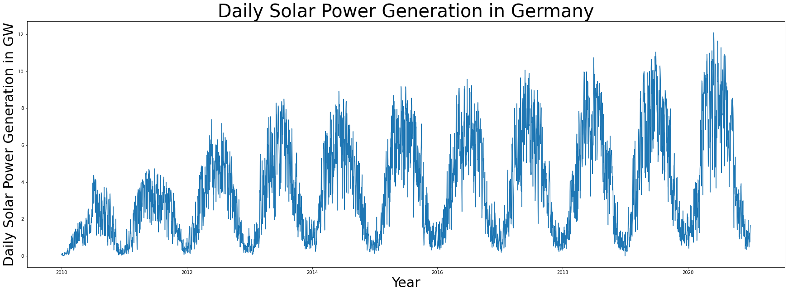
    


## Distribution of the data

**Let us take a look at the distribution of daily power generation.**


```python
sns.displot(daily_df['all'], kde=True)
plt.xlabel('U')
plt.savefig('datadistr.png')
```


    
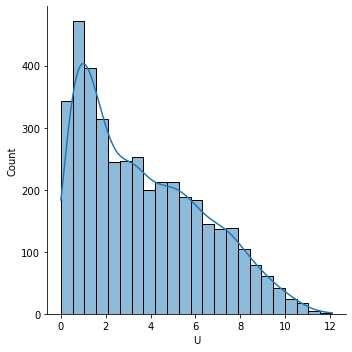
    


**We can see that the distribution is skewed to the left. Since we will later apply a linear regression, we would prefer data that is approximately normally distributed. To shift our distribution, we apply the following transformation.**

**First, we apply Min-Max scaling.**

$\tilde{U_t}=\frac{U_t-U_{min}}{U_{max}-U_{min}}$


```python
scaler = MinMaxScaler()
scaled = scaler.fit_transform(daily_df['all'].to_numpy().reshape(-1, 1))
epsilon = 0.1
scaled[scaled==0]=epsilon
scaled[scaled==1]=1-epsilon
```

**Then, we apply a logit normal transformation to the scaled values.**

$U^*=\log{\left(\frac{\tilde{U}_t}{1-\tilde{U}_t}\right)}$


```python
transformed = np.log(scaled/(1-scaled))
daily_df['transformed'] = transformed
sns.displot(transformed, kde=True, legend=None)
plt.xlabel('$U^*$')
plt.savefig('transformeddistr.png')
```


    
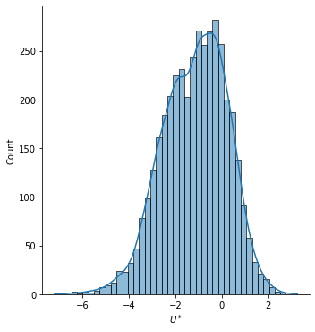
    


**Let us take a look at our transformed time series.**


```python
plt.plot(daily_df['transformed'])
```


    [<matplotlib.lines.Line2D at 0x22e1b2926d0>]


    
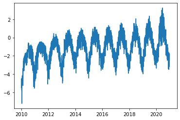
    


## Seasonality

**We can see a strong seasonal component in the data. To get rid of it, we apply a linear regression and continue working with its residuals.  
After thinking about the underlying process behind the data and experimenting with it, we model our data as following:** 


$U^*_t = \beta_0 + \beta_1 \cdot t + \beta_2 \cdot \sqrt[4]t \cos \left(2\pi \frac{t-11}{365}\right)+X_t$  

- $\beta_0$ **is the intercept.**  
- $\beta_1$ **is a linear time coefficient. The behind it is that the amount of solar panels increases steadily over time.**  
- $\beta_2$ **models seasonality. The cosine term describes the yearly seasonality, as power generation heavily depends on natural seasons. The wave is shifted by 11 days. That is because winter solstice is exactly 11 days before New Year. Furthermore, we scale seasonal component by the fourth square-root of time, as a non-linear development of solar energy plants comes into play.**

**We will use the scikit-learn library for implementation. To get more more information about the regression, we will also conduct it using the statsmodels library and print the model summary.**


```python
def get_seasonal_component(timeseries):
    time = np.arange(len(timeseries))
    x_vals = np.array((time, (time**0.25*np.cos(2*np.pi*(time+11)/365)))).T
    lm = LinearRegression().fit(x_vals, timeseries)
    print(f'Intercept: {lm.intercept_}')
    print(f'Coefficients: {lm.coef_}')
    print(f'R-squared: {lm.score(x_vals, timeseries)}')
    return lm.predict(x_vals)

```


```python
time = np.arange(len(transformed))
x_vals = np.array((time, (time**0.25*np.cos(2*np.pi*(time+11)/365)))).T

model = sm.OLS(transformed, sm.add_constant(x_vals))

results = model.fit()

results.summary()
```


<table class="simpletable">
<caption>OLS Regression Results</caption>
<tr>
  <th>Dep. Variable:</th>            <td>y</td>        <th>  R-squared:         </th> <td>   0.724</td>
</tr>
<tr>
  <th>Model:</th>                   <td>OLS</td>       <th>  Adj. R-squared:    </th> <td>   0.724</td>
</tr>
<tr>
  <th>Method:</th>             <td>Least Squares</td>  <th>  F-statistic:       </th> <td>   5272.</td>
</tr>
<tr>
  <th>Date:</th>             <td>Sun, 07 Aug 2022</td> <th>  Prob (F-statistic):</th>  <td>  0.00</td> 
</tr>
<tr>
  <th>Time:</th>                 <td>12:57:19</td>     <th>  Log-Likelihood:    </th> <td> -4394.5</td>
</tr>
<tr>
  <th>No. Observations:</th>      <td>  4018</td>      <th>  AIC:               </th> <td>   8795.</td>
</tr>
<tr>
  <th>Df Residuals:</th>          <td>  4015</td>      <th>  BIC:               </th> <td>   8814.</td>
</tr>
<tr>
  <th>Df Model:</th>              <td>     2</td>      <th>                     </th>     <td> </td>   
</tr>
<tr>
  <th>Covariance Type:</th>      <td>nonrobust</td>    <th>                     </th>     <td> </td>   
</tr>
</table>
<table class="simpletable">
<tr>
    <td></td>       <th>coef</th>     <th>std err</th>      <th>t</th>      <th>P>|t|</th>  <th>[0.025</th>    <th>0.975]</th>  
</tr>
<tr>
  <th>const</th> <td>   -2.0841</td> <td>    0.023</td> <td>  -91.413</td> <td> 0.000</td> <td>   -2.129</td> <td>   -2.039</td>
</tr>
<tr>
  <th>x1</th>    <td>    0.0005</td> <td> 9.83e-06</td> <td>   46.923</td> <td> 0.000</td> <td>    0.000</td> <td>    0.000</td>
</tr>
<tr>
  <th>x2</th>    <td>   -0.2282</td> <td>    0.002</td> <td>  -92.181</td> <td> 0.000</td> <td>   -0.233</td> <td>   -0.223</td>
</tr>
</table>
<table class="simpletable">
<tr>
  <th>Omnibus:</th>       <td>507.081</td> <th>  Durbin-Watson:     </th> <td>   0.620</td> 
</tr>
<tr>
  <th>Prob(Omnibus):</th> <td> 0.000</td>  <th>  Jarque-Bera (JB):  </th> <td>1086.897</td> 
</tr>
<tr>
  <th>Skew:</th>          <td>-0.766</td>  <th>  Prob(JB):          </th> <td>9.62e-237</td>
</tr>
<tr>
  <th>Kurtosis:</th>      <td> 5.036</td>  <th>  Cond. No.          </th> <td>4.64e+03</td> 
</tr>
</table><br/><br/>Notes:<br/>[1] Standard Errors assume that the covariance matrix of the errors is correctly specified.<br/>[2] The condition number is large, 4.64e+03. This might indicate that there are<br/>strong multicollinearity or other numerical problems.


```python
f = open('ols.tex', 'w')
f.write(results.summary(xname=['beta0', 'beta1', 'beta2']).as_latex())
f.close()
```


```python
daily_df['seasonality'] = get_seasonal_component(transformed)
daily_df['cleaned'] = daily_df['transformed'] - daily_df['seasonality']
```

    Intercept: [-2.08409933]
    Coefficients: [[ 0.00046127 -0.22820751]]
    R-squared: 0.7242120048393265


```python
plt.figure(figsize=(15,5))
plt.plot(daily_df['transformed'])
plt.plot(daily_df['seasonality'], c='r', linewidth=3)
plt.legend(['Observed data', 'Regression fit'])
plt.xlabel('Date', fontsize=12)
plt.savefig('seasonality.png')
```


    
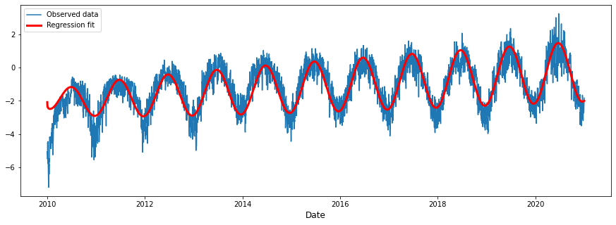
    


### Residuals after regression


```python
plt.plot(daily_df['cleaned'])
plt.title('Residual $X_t$', fontsize=15)
plt.xlabel('Date', fontsize=12)
plt.savefig('afterlm.png')
```


    
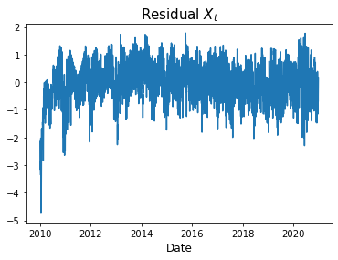
    


**The residuals look good, except in the very beginning. That is no problem, since we can just drop the first year of our data and work with the remaining 10 years.**


```python
daily_df = daily_df[365:]
daily_df.head()
```


<div>
<style scoped>
    .dataframe tbody tr th:only-of-type {
        vertical-align: middle;
    }

    .dataframe tbody tr th {
        vertical-align: top;
    }

    .dataframe thead th {
        text-align: right;
    }
</style>
<table border="1" class="dataframe">
  <thead>
    <tr style="text-align: right;">
      <th></th>
      <th>50Hertz</th>
      <th>Amprion</th>
      <th>Tennet</th>
      <th>Transnet BW</th>
      <th>all</th>
      <th>transformed</th>
      <th>seasonality</th>
      <th>cleaned</th>
    </tr>
    <tr>
      <th>Date</th>
      <th></th>
      <th></th>
      <th></th>
      <th></th>
      <th></th>
      <th></th>
      <th></th>
      <th></th>
    </tr>
  </thead>
  <tbody>
    <tr>
      <th>2011-01-01</th>
      <td>0.011042</td>
      <td>0.022042</td>
      <td>0.058250</td>
      <td>0.009917</td>
      <td>0.101250</td>
      <td>-4.775061</td>
      <td>-2.895385</td>
      <td>-1.879675</td>
    </tr>
    <tr>
      <th>2011-01-02</th>
      <td>0.024542</td>
      <td>0.072958</td>
      <td>0.090208</td>
      <td>0.035667</td>
      <td>0.223375</td>
      <td>-3.973572</td>
      <td>-2.892215</td>
      <td>-1.081357</td>
    </tr>
    <tr>
      <th>2011-01-03</th>
      <td>0.022583</td>
      <td>0.080875</td>
      <td>0.066042</td>
      <td>0.078875</td>
      <td>0.248375</td>
      <td>-3.865377</td>
      <td>-2.888749</td>
      <td>-0.976628</td>
    </tr>
    <tr>
      <th>2011-01-04</th>
      <td>0.019125</td>
      <td>0.089500</td>
      <td>0.067167</td>
      <td>0.067958</td>
      <td>0.243750</td>
      <td>-3.884564</td>
      <td>-2.884988</td>
      <td>-0.999576</td>
    </tr>
    <tr>
      <th>2011-01-05</th>
      <td>0.051042</td>
      <td>0.191000</td>
      <td>0.205750</td>
      <td>0.106500</td>
      <td>0.554292</td>
      <td>-3.036477</td>
      <td>-2.880932</td>
      <td>-0.155545</td>
    </tr>
  </tbody>
</table>
</div>


**We will print the RMSE of our residuals.**


```python
rmse = np.linalg.norm(daily_df['cleaned'])/np.sqrt(len(daily_df))
print(f'RMSE of residuals: {rmse.round(4)}')
```

    RMSE of residuals: 0.6584


```python
sns.displot(daily_df['cleaned'], kde=True)
```


    <seaborn.axisgrid.FacetGrid at 0x22e1b7145b0>


    
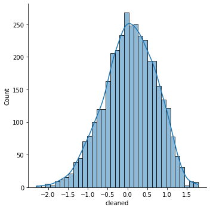
    


**We can see that our residuals are approximately normally distributed.**

## Time series modelling

**Now it is time to work on the time series. First, we inspect its partial autocorrelation.**


```python
fig = plot_pacf(daily_df['cleaned'])
plt.xlabel('Lags', fontsize=12)
plt.title('Partial Autocorrelation', fontsize=15)
plt.savefig('pacf.png')
```


    
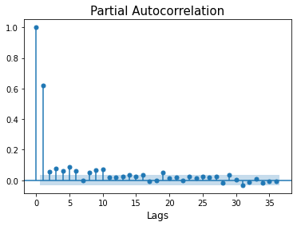
    


**Based on this result, we apply a ARIMA(1,0,1) model.**


```python
model = ARIMA(daily_df['cleaned'], order=(1,0,1)).fit()
```

    C:\ProgramData\Anaconda3\lib\site-packages\statsmodels\tsa\base\tsa_model.py:524: ValueWarning: No frequency information was provided, so inferred frequency D will be used.
      warnings.warn('No frequency information was'
    C:\ProgramData\Anaconda3\lib\site-packages\statsmodels\tsa\base\tsa_model.py:524: ValueWarning: No frequency information was provided, so inferred frequency D will be used.
      warnings.warn('No frequency information was'
    C:\ProgramData\Anaconda3\lib\site-packages\statsmodels\tsa\base\tsa_model.py:524: ValueWarning: No frequency information was provided, so inferred frequency D will be used.
      warnings.warn('No frequency information was'


**Again, we give out the residuals after applying the ARIMA model.**


```python
rmse = np.linalg.norm(model.resid)/np.sqrt(len(model.resid))
print(f'RMSE of residuals after ARIMA: {rmse.round(4)}')
```

    RMSE of residuals after ARIMA: 0.5124


```python
model.summary()
```


<table class="simpletable">
<caption>SARIMAX Results</caption>
<tr>
  <th>Dep. Variable:</th>        <td>cleaned</td>     <th>  No. Observations:  </th>   <td>3653</td>   
</tr>
<tr>
  <th>Model:</th>            <td>ARIMA(1, 0, 1)</td>  <th>  Log Likelihood     </th> <td>-2738.148</td>
</tr>
<tr>
  <th>Date:</th>            <td>Sun, 07 Aug 2022</td> <th>  AIC                </th> <td>5484.296</td> 
</tr>
<tr>
  <th>Time:</th>                <td>12:57:23</td>     <th>  BIC                </th> <td>5509.109</td> 
</tr>
<tr>
  <th>Sample:</th>             <td>01-01-2011</td>    <th>  HQIC               </th> <td>5493.132</td> 
</tr>
<tr>
  <th></th>                   <td>- 12-31-2020</td>   <th>                     </th>     <td> </td>    
</tr>
<tr>
  <th>Covariance Type:</th>        <td>opg</td>       <th>                     </th>     <td> </td>    
</tr>
</table>
<table class="simpletable">
<tr>
     <td></td>       <th>coef</th>     <th>std err</th>      <th>z</th>      <th>P>|z|</th>  <th>[0.025</th>    <th>0.975]</th>  
</tr>
<tr>
  <th>const</th>  <td>    0.0593</td> <td>    0.025</td> <td>    2.338</td> <td> 0.019</td> <td>    0.010</td> <td>    0.109</td>
</tr>
<tr>
  <th>ar.L1</th>  <td>    0.6961</td> <td>    0.018</td> <td>   38.043</td> <td> 0.000</td> <td>    0.660</td> <td>    0.732</td>
</tr>
<tr>
  <th>ma.L1</th>  <td>   -0.1208</td> <td>    0.024</td> <td>   -5.031</td> <td> 0.000</td> <td>   -0.168</td> <td>   -0.074</td>
</tr>
<tr>
  <th>sigma2</th> <td>    0.2621</td> <td>    0.006</td> <td>   43.612</td> <td> 0.000</td> <td>    0.250</td> <td>    0.274</td>
</tr>
</table>
<table class="simpletable">
<tr>
  <th>Ljung-Box (L1) (Q):</th>     <td>0.14</td> <th>  Jarque-Bera (JB):  </th> <td>95.96</td>
</tr>
<tr>
  <th>Prob(Q):</th>                <td>0.71</td> <th>  Prob(JB):          </th> <td>0.00</td> 
</tr>
<tr>
  <th>Heteroskedasticity (H):</th> <td>1.20</td> <th>  Skew:              </th> <td>-0.37</td>
</tr>
<tr>
  <th>Prob(H) (two-sided):</th>    <td>0.00</td> <th>  Kurtosis:          </th> <td>3.30</td> 
</tr>
</table><br/><br/>Warnings:<br/>[1] Covariance matrix calculated using the outer product of gradients (complex-step).


```python
f = open('arma.tex', 'w')
f.write(model.summary().as_latex())
f.close()
```


```python
plt.figure(figsize=(30,10))

# plt.plot(predictions, c='g')
plt.plot(daily_df['cleaned'], c='b')
plt.plot(model.fittedvalues, c='r')
plt.title('Model fit over the whole timespan', fontsize=25)
plt.xlabel('Date', fontsize=18)
plt.legend(['Observed data', 'Model fit'], fontsize=15)
plt.savefig('armafitall.png')
```


    
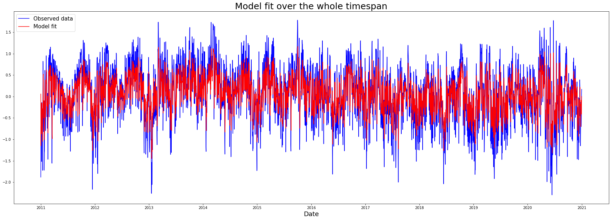
    


```python
plt.figure(figsize=(30,10))

daily_df['arma_fit'] = model.fittedvalues
# plt.plot(predictions, c='g')
plt.plot(daily_df['cleaned'].iloc[365:365*2], c='b')
plt.plot(daily_df['arma_fit'].iloc[365:365*2], c='r')
plt.title('Model fit in 2012', fontsize=25)
plt.xlabel('Date', fontsize=18)
plt.legend(['Observed data', 'Model fit'], fontsize=15)
plt.savefig('armafit1year.png')
```


    
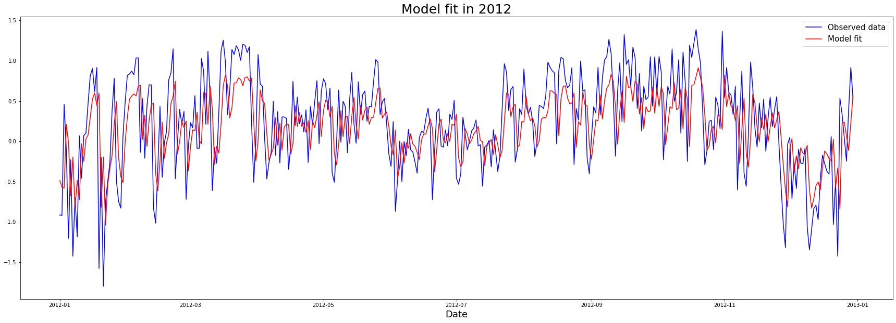
    


**The statsmodels library returns four plots that describe the model fit.**


```python
fig = plt.figure(figsize=(20,20))
a = model.plot_diagnostics(fig=fig)
plt.savefig('residplot.png')
```

    C:\ProgramData\Anaconda3\lib\site-packages\statsmodels\graphics\gofplots.py:993: UserWarning: marker is redundantly defined by the 'marker' keyword argument and the fmt string "bo" (-> marker='o'). The keyword argument will take precedence.
      ax.plot(x, y, fmt, **plot_style)


    
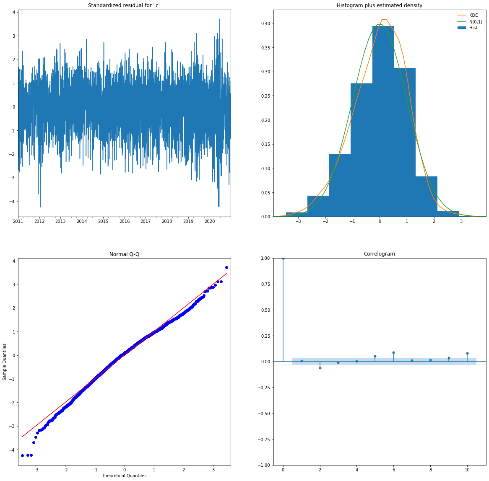
    

